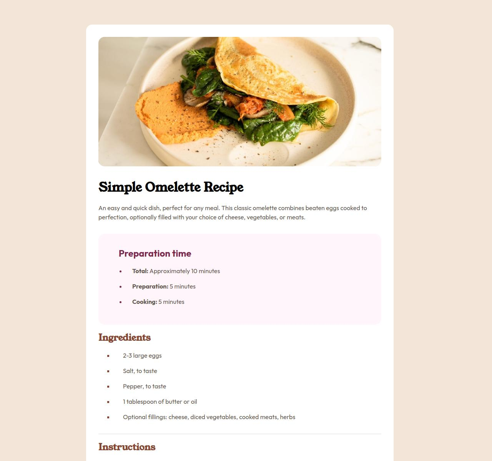
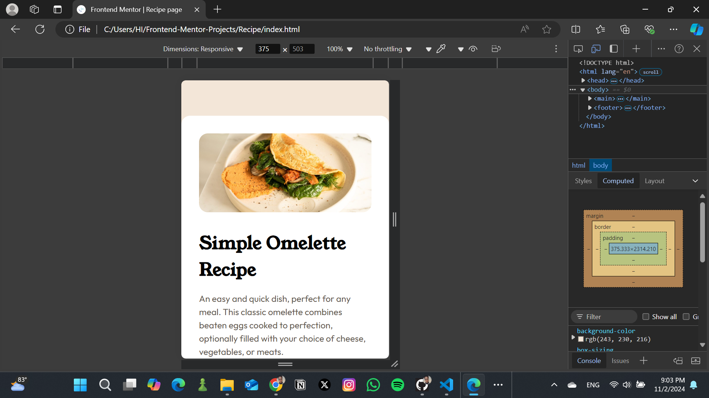

# Frontend Mentor - Recipe page solution

This is a solution to the [Recipe page challenge on Frontend Mentor](https://www.frontendmentor.io/challenges/recipe-page-KiTsR8QQKm). Frontend Mentor challenges help you improve your coding skills by building realistic projects. 

## Overview 

### The challenge
Build an omelette recipe with HTML and CSS

## My Process

### Built with:
- HTML
- CSS

### Links

- Live Site URL: 

## Author

- Frontend Mentor - [@ggllawc4](https://www.frontendmentor.io/profile/ggllawc4)
- Twitter - [@ggllawc](https://x.com/ggllawc)

**Note: Delete this note and add/remove/edit lines above based on what links you'd like to share.**

## Acknowledgments

Thank you, Althea Storm, for introducing this website to me and also for giving me the push I needed.