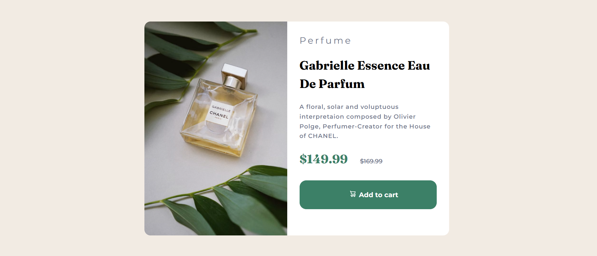

# Frontend Mentor - Product preview card component solution

This is a solution to the [Product preview card component challenge on Frontend Mentor](https://www.frontendmentor.io/challenges/product-preview-card-component-GO7UmttRfa). Frontend Mentor challenges help you improve your coding skills by building realistic projects. 

## Table of contents

- [Overview](#overview)
  - [The challenge](#the-challenge)
  - [Screenshot](#screenshot)
  - [Links](#links)
- [My process](#my-process)
  - [Built with](#built-with)
  - [What I learned](#what-i-learned)
  - [Continued development](#continued-development)
  - [Useful resources](#useful-resources)
- [Author](#author)
- [Acknowledgments](#acknowledgments)

## Overview

### The challenge

Users should be able to:

- View the optimal layout depending on their device's screen size
- See hover and focus states for interactive elements

### Screenshot



### Links

- Solution URL: [Add solution URL here](https://your-solution-url.com)
- Live Site URL: [Add live site URL here](https://ggllawc4.github.io/Frontend-Mentor-Projects/product-preview-card-component-main/index.html)

## My process

### Built with

- Built with HTML5 markup
- CSS custom properties
- Flexbox

### What I learned

I learnt how to use media queries to control the display of an image within a div, making it responsive across different screen sizes.

```css
.proud-of-this-css {
  display: none;
}
```

### Continued development

I would like to continue my development in CSS box model, positioning, and media queries.

### Useful resources

- [MDN](https://developer.mozilla.org/en-US/) - This helped in understanding box model and positioning. I really liked this and will use it going forward.\

- [Fed Mentor.Dev](https://fedmentor.dev/posts/padding-margin/) - This blog helped me in understanding padding and margin. I really liked this and will use it going forward.

## Author
- Frontend Mentor - [@ggllawc4](https://www.frontendmentor.io/profile/ggllawc4)
- Twitter - [@ggllawc](https://x.com/ggllawc)